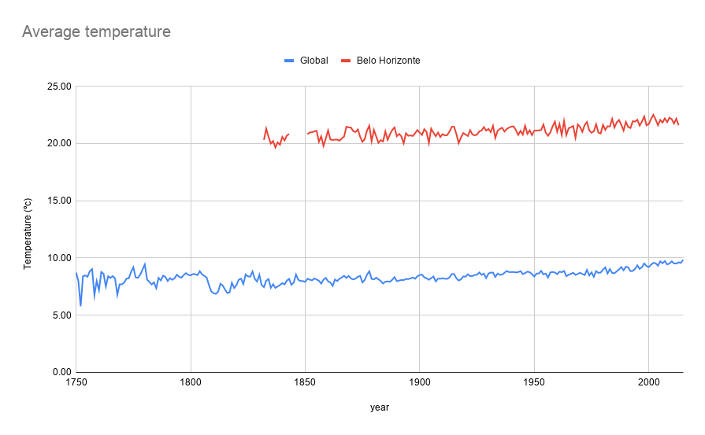
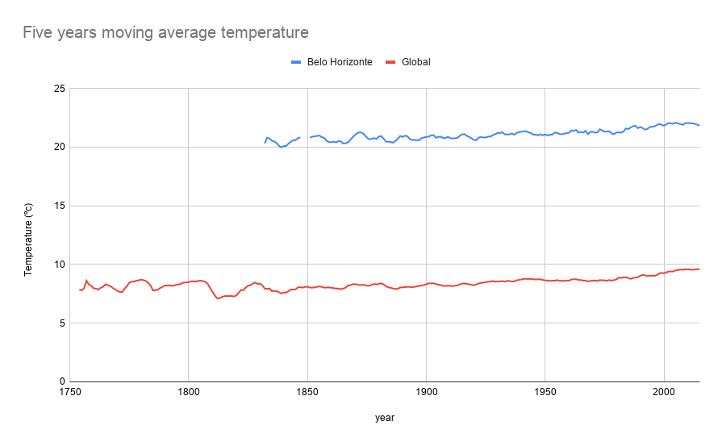
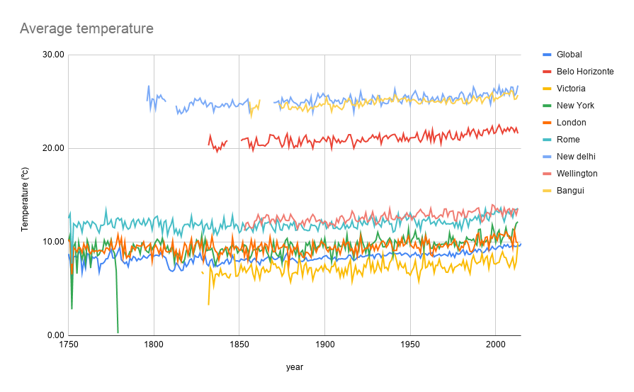
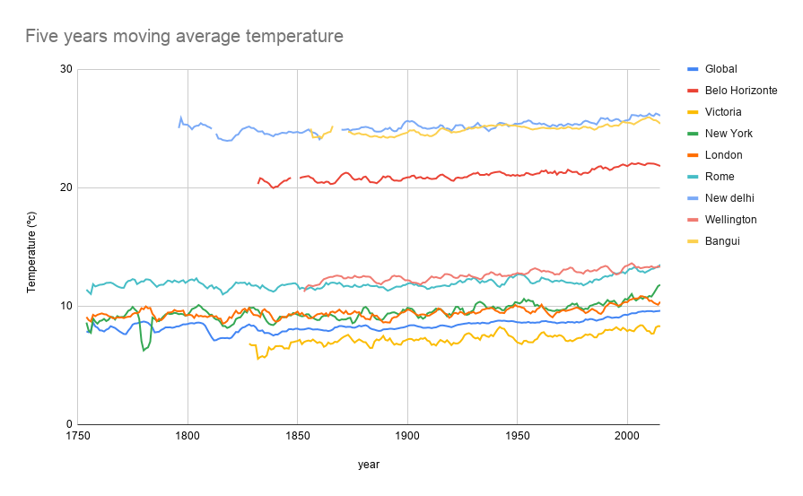

The first thing I did was to know which cities are available in the database. For this, I used the following query:

`SELECT * FROM city_list WHERE country = 'Brazil' LIMIT 20;`

I chose *Belo Horizonte* because it is my current city.

I used the following query to export the data in a csv file
`SELECT * FROM city_data WHERE country = 'Brazil' AND city = 'Belo Horizonte';`

And this to export the global data
`SELECT * FROM global_data;`

After that, I copied and normalized the data in [Google Sheets](https://docs.google.com/spreadsheets/d/1AUux7VlKLOSy0oDaDdDHkV_BSKe_nXAbJCOqxx0ps3E/edit?usp=sharing) and created the first graph.

Based on the data, I created the moving average using the period of five years and created the second graph.

Based on the data I can conclude:
1. Belo Horizonte's average temperature is hotter than the global average temperature.
2. Belo Horizonte's average temperature is quite stable, with little variations over the years.
3. Global average temperature is rising. In the last few years it has been growing at a fast pace, reaching larger numbers than the previous ones.
4. Overall, the Belo Horizonte average temperature is growing, but at a slower pace when compared to the global average temperature.

After that, I repeated the process for other cities, using the following queries to retrieve the data:
* Victoria (Canada): `SELECT * FROM city_data WHERE country = 'Canada' AND city = 'Victoria';`
* New york (United States): `SELECT * FROM city_data WHERE country = 'United States' AND city = 'New York';`
* London (United Kingdom): `SELECT * FROM city_data WHERE country = 'United Kingdom' AND city = 'London';`
* Rome (Italy): `SELECT * FROM city_data WHERE country = 'Italy' AND city = 'Rome';`
* New delhi (India): `SELECT * FROM city_data WHERE country = 'India' AND city = 'New Delhi';`
* Wellington (New Zealand): `SELECT * FROM city_data WHERE country = 'New Zealand' AND city = 'Wellington';`
* Bangui (Central Africa Republic): `SELECT * FROM city_data WHERE country = 'Central African Republic' AND city = 'Bangui';`

With the data I generated the third graph using the average temperature:

And the fourth graph using the five years moving average:

Based on this, I can conclude:
1. Usually, the temperature in a city have a low variation over the years
2. New York had a wide variation in temperature before 1800
3. It’s a trend of all cities to increase the temperature over the years
